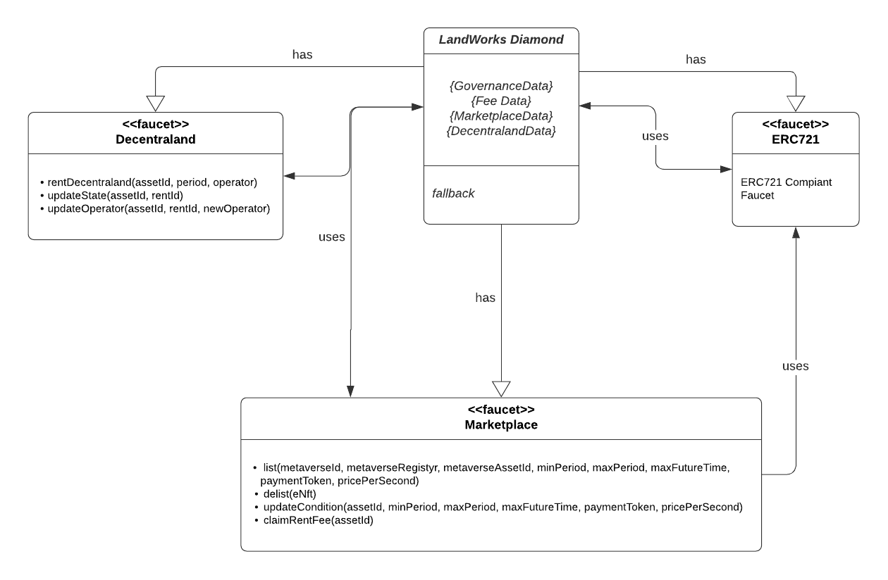

# LandWorks Whitepaper

# About LandWorks

## Why LandWorks

As stated in the EnterDAO whitepaper, the Metaverse is a booming economy enabled by crypto, DeFi and NFTs, yet still in its infancy. Metaverses based games, galleries and more, have become the defacto next step for NFT projects, especially the exponentially growing character-based games. For them to realise this next metamorphosis of their projects, they need to "install" their projects inside a Metaverse. For that, they need land.

Metaverse land is an extremely potent new advertising and event space, that could be used for different purposes such as games, product launches/drops, parties and all kinds of virtual events, etc. Yet, Metaverse land is prohibitively expensive and lacks a shared economy model.

LandWorks is here to changes that!

## The Protocol

LandWorks is a land-as-a-service type of protocol based on Ethereum and is part of the portfolio of products developed and maintained by the EnterDAO community.

The protocol enables period-based renting of land in the metaverses. The protocol will start with [Decentraland](https://decentraland.org/) as a primer and then gradually expand to support the rest of the prominent Metaverses. It will enable landowners to earn passive income on their assets, while renters looking to leverage metaverses will be able to easily rent instead of buying the land properties.

## Governance

The protocol will be governed by a DAO. Governance operations such as changing the rent protocol fee, upgrading the protocol contracts, adding support for new Metaverses or simply introducing new features in the protocol, will be executed and applied by the EnterDAO after a governance poll passes.

## Stakeholders

- **Land lenders** - Landowners will have the chance to put to use an idle capital - the land - without needing to part ways with it. They will be able to offer their price per unit of time.
- **Land renters** - Land renters will have the chance to make use of otherwise hard to get land for a period of time. This could be utilised by:
    - Metaverse games that need to test out their products before committing to an expensive purchase (or even completely abandoning land purchase). A prime example of this is the many NFT character-based products that are looking at the metaverses as the next step for their products.
    - Brands and agencies that wish to throw an event or a stunt to gain advertising/marketing benefits. Could be anything from crypto protocols throwing up a party (meta rAAVE, wink wink) or Louis Vuitton doing a fashion show.
- **The Protocol** - the protocol will have various business value streams enabled including -
    - Commission fees on rents
    - Auctions and marketplaces for advertising space.
- **Small Investors** - through the protocol, possible fractional owners of land can start enjoying the benefits of their fractional ownership of land.
- **Scene creators** - scene creators can start offering their services similarly to how advertising and event agencies do. They can start enabling a full package of design, renting and running a scene for their clients.

## Value Propositions

- **Capital efficiency for Metaverse land** - Depositing your land with the LaaS protocol enables land lenders to earn income from its usage.
- **Accessibility** - Rent land that will otherwise be unavailable. Not just any land, but the best land.
- **Affordability** - Rent land that will otherwise be prohibitively expensive.
- **Shared economy for land** - Renters can safely pool together and rent land running co-events.
- **A scene as a service** for metaverse service providers/events organizers. E.g. this could open a market for events agencies organizing metaverse events for different brands.
- **Commission** - The DAO earns a commission fee from the market activity in the protocol.
- **Governance** - $ENTR holders will be able to govern the future of the protocol and its treasury.

## LandWorks in the EnterDAO Ecosystem

EnterDAO and LandWorks are intertwined and interact with each other in various ways. These ways will be changing over time but initially, they will be:

- $ENTR token holders will be able to govern the future of LandWorks
- LandWorks commission fees go directly into the EnterDAO treasury
- LandWorks lenders will be able to participate in $ENTR yield farming by staking and locking their `eNFT`. Read more about `eNFT`s below.

# Technical Design

## Stakeholders, Processes & Glossary

The following stakeholders are present in the protocol:

- `lender` - Owners of metaverse land. They will have the chance to put to use an idle capital - the land without the need to part ways with it. They will be able to offer their price per unit of time.
- `renters` - Users paying for the usage of land for a period of time. Potential users are developers of metaverse games, brands and agencies that want to organise events.
- `the DAO` - The EnterDAO will be used to govern the protocol and make sure that the incentives between the stakeholders are aligned.
- `operator` - The Externally Owned Account (EOA) authorised to install scenes on LANDs
- `ruler` - `renters` are referred to `rulers` if

```json
startingBlockNumber <= currentBlockNumber < endingBlockBumber
```

where `startingBlockNumber` & `endingBlockNumber` are the blocks for which the renter paid to rent the land.

- `service providers` - Scene creators offering design services, renting and running scenes for their clients.
- `eNFT` - NFT token, specific to a metaverse representing the ownership of NFT lent.

## User flows

### Providing Land

Users who own Мetaverse land will be able to `add` their land into the LandWorks protocol by executing an `add` transaction. Once executed, the land NFT will be transferred and locked into the LandWorks contracts. The protocol will mint `eNFT` (representing the deposited land) to the sender in exchange for that.

The owner of the land will specify the following properties as part of the `add` transaction:

- `minPeriod` - the minimum number of blocks the land can be rented
- `maxPeriod` - the maximum number of blocks the land can be rented
- `maxFutureBlock` - the block delta after which the protocol will not allow for the land to be rented. Example: If `maxFutureBlock=100_000`, the land will be rented at most 15 days in the future (100_000 * 13sec = ~15days).
- `pricePerBlock` - the price of the rent charged per block

Lenders will be able to control the assets that they will be getting paid in. They will be able to choose from a whitelisted set of `ERC20` tokens or `ETH` as a form of payment. The list of supported tokens will be governed by the EnterDAO.

### Removing Provided Land

Users that own `eNFT`s will be able to `remove` the land represented by the `eNFT` from the marketplace. Once executed, the transaction will:

- Transfer and burn the `eNFT`
- Payout the accumulated rent to the `eNFT` owner
- Transfer the original land `NFT` to the `eNFT` owner

**Note (1):** It is important to note that the protocol does not track which address provided the land. The address that added the land can be different from the address that removes the land from the protocol. The `eNFT` represents the right to remove the land and claim the rent fees.

**Note (2):** The land can be removed from the protocol only if it does not have a `ruler`. If the land has a `ruler`, triggering the remove land method "takes the land off the market" and enters it in a state of "for withdrawal". Scheduled rents will be honoured, but no new rents will be accepted. This will secure the owner from a "DDoS" attack - an attack where an owner of particularly interesting land can never withdraw their land from the protocol as it constantly gets booked.

**Note (3):** In the future, ****lenders will be able to define custom algorithms for rent prices such as proportional decrease for `pricePerBlock` with the increase of the `period` of renting.

### Transfer Provided Land (`eNFT`)

Lenders will receive `eNFT` that represents the ownership of a given land deposited in the protocol. `eNFT`s can be transferred/bought/sold or even used as collateral in other protocols. This provides additional flexibility to lenders and opens the LandWorks protocol to be used by or be integrated into other protocols.

### Renting Land

Users that want to rent land will be able to do it by executing `rent` transaction. The renter will specify:

- `eNFT` - The ID of the Land that he wants to rent
- `period` - number of blocks for which the land will be rented
- Other metaverse specific arguments such as `operator` address (in the case of Decentraland). The `operator` address will be set as a default operator of the LAND.

The following requirements must be met for the user to rent the land:

- `period` must be higher than `minPeriod` and lower than `maxPeriod` and `maxFutureBlock`

If the requirements are met, the protocol will charge the user for the rent upfront and accredit it to the `eNFT` as unclaimed rent. The renter will be added to the queue of renters (if there are any).

The land is always rented starting from the last rented block **(if the land has a `ruler`)** or at the current block of the `rent` transaction **(if the land does not have a `ruler`)**.

**Note:** Renters do not have the ability to specify the `startBlock` at which they will rent the land. Although this may seem to limit renters, it protects lenders from DDoS rent attacks. If renters have the ability to rent at a certain block `X`, they might execute `rent` transactions that rent for a `minPeriod` number of blocks every `minPeriod` block. This will greatly impact the ability of lenders to utilise their land. As a side effect, this design will introduce a FOMO for renters since they will not be able to "reserve" the land at a specific time in the future, rather they will be "queuing up" to rent the land whenever it is available.

### Land Status Update

Since renters will be queueing when they execute `rent` transactions, there is no guarantee that the renter will immediately become the `ruler` of the land. If there are other renters before him, he will get to be the `ruler` at some point in the future. If that is the case, the protocol must have a mechanism to grant permissions to the `renter` to install scenes at the time when he becomes the `ruler`.

**Decentraland**

There will be a `updateState(eNFT, ruler)` transaction that will update the `ruler` of the LAND to the one specified as an argument if it is indeed the `renter` that must be the new `ruler`. Anyone can execute the transaction. The transaction will change the `operator` of the LAND to the one specified by the `ruler`. Doing so, the protocol will authorise the `ruler` to install scenes. He will not be able to transfer or sell the rented land. The only permission given to him is the permission to install scenes.

**Note (1):** The `ruler` will be able to update the default `operator` address that he provided as part of the `rent` transaction. He will be able to do so by executing `updateOperator` transaction.

**Note (2):** Since anyone can execute `updateState`, the operation will update the `operator` of the LAND only if the new `ruler` is different from the current `ruler`. This is mandatory to mitigate attacks in which external users are executing the `updateState` transaction to reset the `operator` to the default `operator` provided by the `renter` as part of the `rent` transaction (the `ruler` have updated the `operator` using `updateOperator` transaction)

If the renter queue is empty and no one is renting the LAND, LandWorks's off-chain jobs will trigger the `updateState` transaction providing `0x0` as `ruler`. If indeed no `renter` must be updated to a `ruler`, the current `operator` of the LAND will be changed to the  LandWorks EOA administrator address. The scene of the LAND will be updated to a default one that advertises the  LandWorks protocol, the DAO, and the land lender.

Renters will have an incentive to execute the `updateState` transaction once they become `rulers` to get permission to use the rented LAND and install scenes.

The incentive for Lenders and the Protocol to execute the transaction comes from the fact that they will:

1) be able to advertise both the LAND as well as the protocol to future renters/lenders

2) not be providing "free land usage" to the previous `ruler`

### Using Rented Land

Depending on the metaverse the user rents land in, the process for installing scenes will be different.

**Decentraland**

The development of scenes and experiences will be the same for users directly owning the land or renting it through the protocol. By default, the protocol will be marking the `ruler` as `operator` of the LAND (more on that [here]()), thus enabling him to be able to install scenes.

For in-depth information on how scenes are designed and built, you can refer to Decentraland's [documentation](https://docs.decentraland.org/).

### Claiming Accrued Rent

Owners of `eNFT` are eligible to execute `claim` transaction that will pay out the accrued rent to the owner of the `eNFT`. The rent will be available for claiming immediately after the property is rented. Since both lenders and renters cannot revert the renting of land, it is safe for the protocol to allow for lenders to claim their rents even though the rent period is not over. That would mean that the capital coming from rent will be available to lenders even before the `renter` has even become a `ruler` of the land. If there is a big queue for popular land, lenders may end up getting paid several months before the actual `renter` becomes the `ruler`. This mechanism will incentivise more landowners to provide their land to the protocol.

### Updating lending conditions

Lenders (`eNFT` owners) will be able to update their lending conditions by executing `updateConditions` transaction. They will be able to update the parameters on the Land they provide in the protocol. Those parameters are the same as the one specified on `add` transactions:

- `minPeriod` - the minimum number of blocks the land can be rented
- `maxPeriod` - the maximum number of blocks the land can be rented
- `maxFutureBlock` - the block delta after which the protocol will not allow for the land to be rented. Example: If `maxFutureBlock=100_000`, the land will be rented at most 15 days in the future (100_000 * 13sec = ~15days). This is needed in order to enable the lender to balance between land usage optimisation and their own perceived rate of land price increase. It is advised for them to set it to the minimum period they feel that the land will noticeably appreciate therefore the rent should be increased.
- `pricePerBlock` - the price of the rent charged per block
- `tokenAddress` - the token in which rent will be charged (if different from ETH)

**Note (1):**

The protocol will payout the current unclaimed rent to the `eNFT` owner as a part of the `updateConditions` transaction.

**Note (2):**
The new lending conditions will be applied the next time the land is rented and will not affect the current `renters` in the queue and `rulers`.

## Technical components


The protocol will be based on the [EIP-2535 Diamond](https://eips.ethereum.org/EIPS/eip-2535) design pattern. The following benefits will be captured due to this decision:

- Be able to do fine-grained upgrades through the DAO
- Being able to resolve security vulnerabilities
- Being able to extend the functionality and develop the protocol incrementally
- Being able to remove the upgradeability of the contracts once the protocol matures

**The**  **LandWorks Diamond**

This smart contract will be the base of the diamond storing the data for the different facets. This will be the point of entry and the "official" external address that will be used to interact with the protocol.

**Governance**

The faucet will be providing the DAO management operations such as adding/removing/updating faucets of the  LandWorks diamond.

**Marketplace**

The Marketplace faucet will be providing the base functionality of the protocol. It will be responsible for `adding`, `removing` and `updating` lands. Lenders will be able to claim their rents through this faucet.

**Metaverse Specific Faucets**

We can distinguish 2 categories of faucets and contracts in the protocol - `Core` and `Metaverse Specific`. Core components are generic, foundational and used in the context of any `metaverse`. The logic that is specific to a given metaverse will be extracted to its own `faucet`.

**Metaverse Specific ERC721**

There will be a separate `ERC721` instance for every metaverse supported in the Protocol. Once land is added in the marketplace, the protocol will mint a specific to that metaverse NFT to the lender.

### Decentraland

The following diagram provides an overview of the contracts of the Protocol and more specifically, focuses on the functions specific to Decentraland's integration.



All of the 3 functions (`rent`, `udpateState` and `updateOperator`) in the Decentraland faucet are specific to the Decentraland metaverse. Base internal methods will be introduced in the `core` faucets to have a reusable code base upon `metaverse` integrations are building on. Utilising this pattern provides a good encapsulation of the logic for the different metaverses.

In the context of Decentraland, the protocol will be minting `eLAND` NFTs for LAND providers.

## Fees

There will be a default `protocol fee` of `3%` every time a `renter` pays rent to the landowner. The fee will be a revenue stream for the DAO and DAO token holders will have the ability to vote on changing the protocol fee.

One common problem for DAOs is the diversification of the DAO Treasury. Since lenders will be able to define various payment options, the protocol fee will be comprised of various assets that will act as a diversification mechanism for the DAO's treasury.

## Security

Security is a top priority and it is critical for the protocol. Based on our expertise we can define the following efforts and tactics to mitigate security issues:

- Smart Contract Development Framework - [Hardhat](https://hardhat.org/) will be used for the development and testing of the contracts. It is an established and well-known framework for solidity and smart contract developers, thus it will be easier for external developers to do peer reviews. The DAO will not prioritise obfuscation of code.
- Unit Tests - All smart contracts will have 100% code coverage as well as cover as many use-cases and edge-cases possible.
- Static Analyzers - [slither](https://github.com/crytic/slither) will be used to execute static analysis tests against the smart contracts for well known SWC issues.
- Smart Contract Fuzzer - [echidna](https://github.com/crytic/echidna) will be used to execute fuzz tests against the smart contracts
- Upgradeability - The [Diamond](https://eips.ethereum.org/EIPS/eip-2535) upgradeability pattern will be used. Only the DAO will be able to execute upgrades on the smart contracts after the governance vote passes. Upgradeability will be used to mitigate and resolve vulnerabilities found in the contracts.
- Security Audits - the protocol will be audited by a reputable audit company
- Bounties - The DAO will incentivise white hat hackers by providing bounties for reporting vulnerabilities.